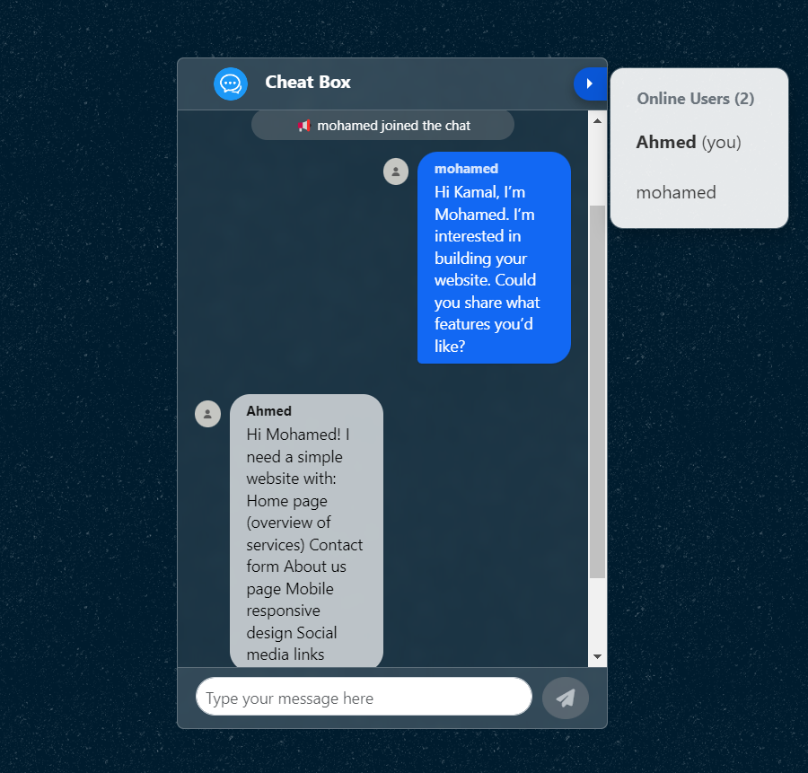

# Group Chat Application

A real-time chat application built with **python** for the backend and **JavaScript** for the frontend using WebSockets for live communication. This project allows users to join chat rooms, send and receive messages instantly, and view a list of connected users.

## Features

- **Real-time messaging** using WebSockets
- **Multiple chat rooms** with dynamic user lists
- **Message persistence** using a backend server 
- **Responsive UI** for desktop and mobile usage

## Technologies Used

- **Backend:**python
- **Frontend:** JavaScript, HTML, CSS
- **Real-time communication:** WebSocket using **Socket.io**

